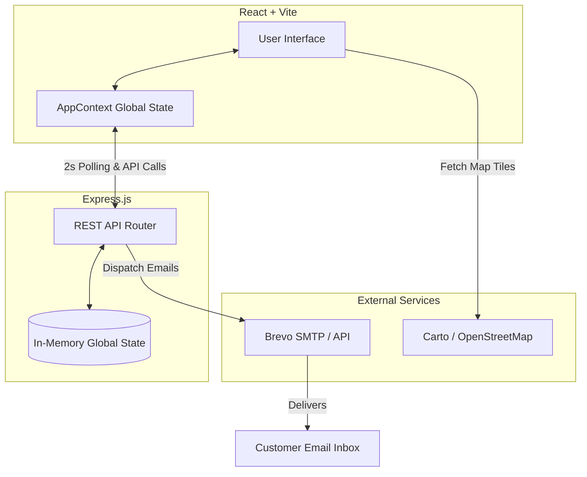
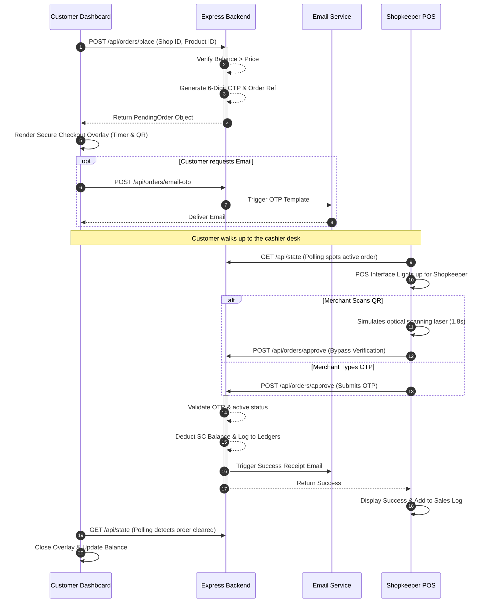

# Stikbook Premium Rewards Wallet & Partner Platform

A robust, full-stack React and Express application demonstrating a complete reward coin (Stikcoins) ecosystem. It features a modern, high-tech interface with roles for both Customers (who earn and spend coins) and Shopkeepers (who process orders and approve redemptions). 

---

## 🚀 Project Overview & Vision

Stikbook is designed as a dynamic, interactive mock-up of a digital rewards platform. The system operates on a central "Stikcoin (SC)" currency, showcasing an end-to-end flow from daily check-ins to geolocated store discovery, secure checkout via OTP/QR, and merchant point-of-sale (POS) verification.

### 🌟 Premium UI/UX & Aesthetics
*   **Glassmorphism & Neon Glow:** Interfaces employ deep dark modes, surface blurring (glassmorphism), and subtle neon glowing accents (green for users, gold for merchants).
*   **Micro-Animations:** Fluid CSS keyframes (`fadeIn`, `pulse`, `laserScan`, `float`) breathe life into every interaction, from the login screen winged-coin to the radar sweep.
*   **Web Audio API Synthesizer:** Built-in sound effects (using oscillators) trigger on specific actions like coin claims (retro double-ding), scanning (high-tech beep), success (arpeggios), and errors (sawtooth buzz), mapped to an animated audio visualizer EQ.

### 📍 Advanced Features
*   **Live GPS Radar:** Built-in `react-leaflet` integration. Users can switch between simulated drifting GPS and real device location to discover nearby merchants. 
*   **Haversine Distance:** Real-time distance calculation determines how far away a shop is in meters.
*   **Secure OTP & QR Checkout:** Redemptions generate a time-limited 6-digit OTP and QR code payload.
*   **Live Merchant POS Sync:** The Shopkeeper dashboard listens for real-time order broadcasts, handling QR scanning (simulated) or manual OTP input.
*   **Transactional Email Integration:** Uses Brevo (formerly Sendinblue) to dispatch OTP emails and transaction receipts directly from the backend.
*   **Centralized Backend State:** An Express server maintains an in-memory data store synchronizing data across client sessions via rapid polling.

---

## 📊 System Flow & Architecture Diagrams

### High-Level Architecture


### Complete Order Redemption Flow
This illustrates the interaction between a Customer, the Backend, and the Shopkeeper during a checkout.



---

## 🛠️ Technology Stack Deep Dive

### Frontend Stack
*   **React 19:** Utilizing functional components, `useState`, `useEffect`, `useCallback`, and `useMemo` for optimal re-rendering.
*   **Vite:** Ultra-fast bundling, Hot Module Replacement (HMR).
*   **React Router v7:** Client-side routing between Login, Customer, and Shopkeeper views.
*   **React Leaflet (v5) & Leaflet (v1.9):** Renders custom markers, dynamically re-centers maps, and projects radar radius circles.
*   **qrcode.react:** Generates high-fidelity SVG QR codes dynamically based on pending OTP strings.
*   **Context API:** Centralized logic in `AppContext.jsx` avoids prop-drilling and handles backend polling loops.

### Backend Stack
*   **Node.js & Express (v4.19):** Lightweight web framework defining JSON REST endpoints.
*   **In-Memory Store:** The `server.js` maintains volatile state logic (users, balances, arrays of `shopOrders` and `transactions`). Dev commands allow resetting this instantly.
*   **CORS:** Cross-Origin Resource Sharing enabled for local dev between Vite and Express.
*   **Brevo API (`utils/brevo.js`):** Custom utility wrappers utilizing `fetch()` to hit Brevo's `v3/smtp/email` endpoint securely.

---

## 📂 Detailed Project Structure

```text
c:\Users\T490\OneDrive\Pictures\ui\
├── backend/
│   ├── utils/
│   │   └── brevo.js             # Email integration logic for Sendinblue/Brevo
│   ├── server.js                # Express app, APIs, and in-memory data store
│   └── package.json             # Backend dependencies (express, cors, dotenv)
├── src/
│   ├── components/
│   │   └── StikcoinsScreen.jsx  # Legacy emulator view & Web Audio Synthesizer
│   ├── context/
│   │   └── AppContext.jsx       # Global State, Polling engine, API fetch wrappers
│   ├── pages/
│   │   ├── CustomerDashboard.jsx  # Map, shop listing, daily claim, checkout overlay
│   │   ├── ShopkeeperDashboard.jsx# Cashier POS, optical scan simulation, sales ledger
│   │   └── LoginPage.jsx        # Role selection, auth validation, animated brand logo
│   ├── utils/
│   │   └── soundEffects.js      # Global Web Audio API oscillator helper
│   ├── App.jsx                  # Main React Router setup
│   ├── index.css                # Global styles, variables, typography
│   └── main.jsx                 # React root render
├── package.json                 # Frontend dependencies (React, Vite, Leaflet, etc.)
└── vite.config.js               # Vite bundler configuration
```

---

## 💻 Running the Project Locally

### Prerequisites
*   Node.js (v18+ recommended)
*   npm or yarn

### Setup

1. **Install Frontend Dependencies:**
   Open a terminal in the root directory:
   \`\`\`bash
   npm install
   \`\`\`

2. **Install Backend Dependencies:**
   Navigate to the backend and install:
   \`\`\`bash
   cd backend
   npm install
   \`\`\`

3. **Environment Variables:**
   Create a `.env` file in the `backend/` directory to enable real email sending:
   \`\`\`env
   PORT=5000
   BREVO_API_KEY=your_brevo_api_key_here
   BREVO_SENDER_EMAIL=your_sender_email@example.com
   \`\`\`
   *(Note: The server has fallback mock credentials if you don't supply these, but email delivery will be simulated).*

### Execution (Two Terminals Required)

**Terminal 1: Start the Backend Server**
\`\`\`bash
cd backend
npm run dev
\`\`\`
*The Express API will run on \`http://localhost:5000\`.*

**Terminal 2: Start the Frontend React App**
From the project root:
\`\`\`bash
npm run dev
\`\`\`
*The Vite application will be accessible at \`http://localhost:5173\`.*

---

*Stikbook Premium Labs Mockup — Bridging the gap between digital rewards, real-world geolocation, and POS mechanics.*
